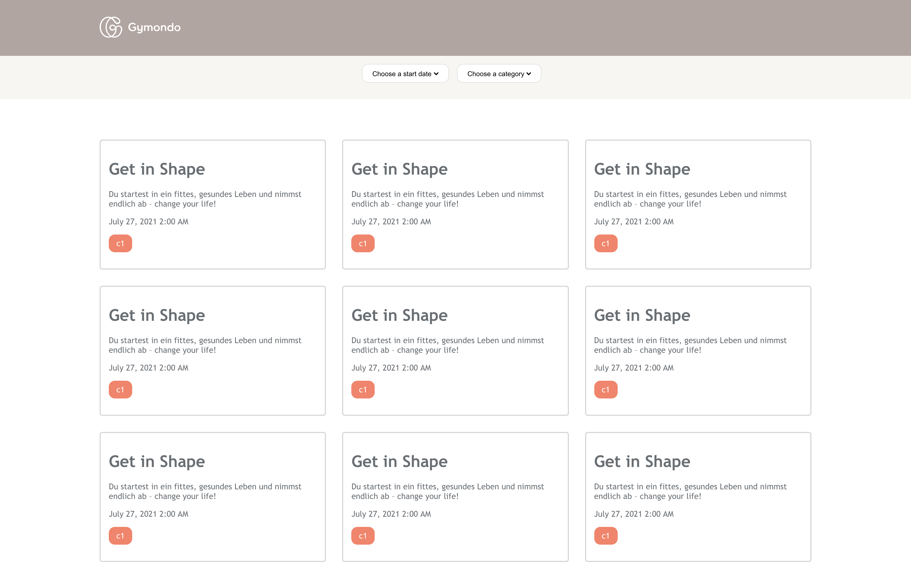

## Gymondo React App

Build a list of workouts and their details so that the user can can choose one that best fits their schedule.

[Jennifer Wjertzoch](mailto:wjertzochjennifer@gmail.com)

## Proposed Solution

- Breaking the UI into components
    * Workout List Page
    * Workout List
    * Workout Detail
    * Header
    * Pagination

- Creating the root component App.js
    * Create a basic setup for rendering workouts (cards for each workout that links to a workout detail page)
    * Fetching Workouts from created Restful API
    * Adding Routes by implementing react-router-dom to navigate between the different URLs

- Create workout list component
    * This component will map through the workouts from the API

- Create workout detail component
    * This component will take care of the workout detail page

- Create workout list page component
    * This component will bring all the components together and make it possible to filter through workout category and start date via custom select

- Add styling by using styled components

## Screenshots

## Libraries / Tools Used

- React.js
- React Router Dom
- Styled-components

## Setup

To install the dependencies run:

`npm install`

And to run the app:

`npm start`

### Running the tests

#### Unit Tests

You can run the unit tests using:

`npm test`

#### Integration Tests

To run Cypress in interactive mode run:

`npm run cy:start`

